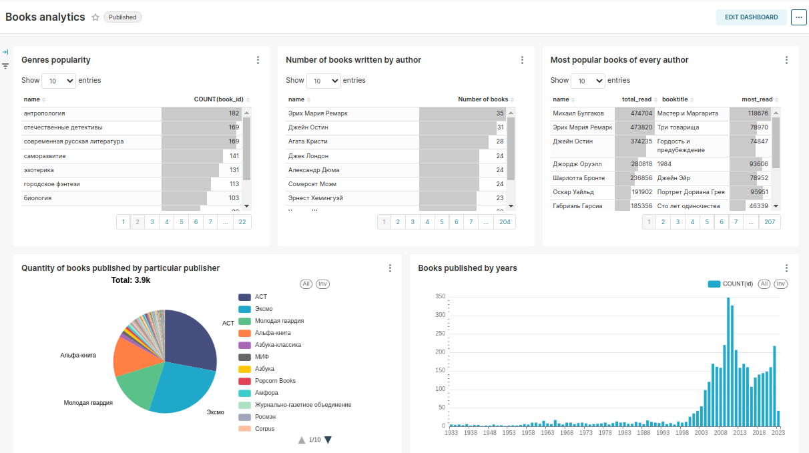
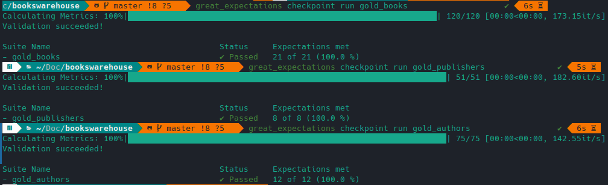

# Description
This repo contains a project which is used for performing analysis of the books, their authors and publishers on the popular [web-site LiveLib](https://www.livelib.ru/). Every day this pipeline parses "New Books" page and adds them, their authors and publishers to respective tables. Every table undergo specific transformations needed for downstream tasks (e.g. dashbords, recommender systems).


# Technologies used
The books warehouse is made from the following tools: 

* Parsing: BeautifulSoup4
* Transformations: Apache Spark, Scala
* Data validation: Great Expectations
* Database: PostgreSQL
* Orchestration: Apache Airflow
* Contrainers: Docker, docker compose
* Dashboards: Apache Superset

For containers is used modified original Airflow docker compose file with two [bitnami Spark services](https://hub.docker.com/r/bitnami/spark/).

Modules that are used inside this pipeline are included in [requirements.txt](requirements.txt) file.

# Architecture

Everything works through Docker containers, which are running via docker compose (well, except Superset).

Every day "New Books" page is parsed and links on books are aquired. After that 4 threads are parsing every book page. IDs of Authors and Publishers are passed throught XComs to different tasks and then separate parsers do the same stuff with those sections of the site.

After that data is cleared and transformed several times and stored in different schemas (I decided to use medallion architecture for storing middle and final results).

Before pushing data to golden schema it validated with Great Expectations. Mostly data expected to be not null and in acceptable range to track outliers.


From golden schema data is going to downstream users for further processing (analytics in this case). 



# Installation
1. Download and install:
    * Docker, docker compose
    * Scala, sbt
2. Clone repo locally.
3. Create image for Apache Airflow:
```
docker build -f Dockerfile.Airflow . -t airflow-spark 
```
4. Create image for Apache Spark:
```
docker build -f Dockerfile.Spark . -t spark-air  
```
5. Compile all scala files with Apache Spark code, move it to directory where Airflow looks for them and additionally download PostgreSQL driver:
```
sh setup.sh
```
# Usage
When installation is complete, you can run `docker compose` to start all necessary services.

Check whick ip does your postgres have by using command:
```
docker inspect -f '{{range.NetworkSettings.Networks}}{{.IPAddress}}{{end}}' bookswarehouse-postgres-1
```
Add it as connection on Airflow GUI.
Since docker assigns different ip's to its containers, your might be different from mine, and you might need to change respective values in .scala files and Great Expectations .yml config. Second connection you need to create is Apache Spark, where provide path to Spark Master (`spark://spark:7077`)
# Data validation

For ensuring that transformations are successful and data doesn't contains anomalies is performed validation with Great Expectations. Following checks are performed:

1. Null values not acceptiptible in most columns.
2. Values "Year", "Rating", "Pages" etc. should be in acceptible range.
3. Values "Favorite" "Liked", "Disliked", "Neutral", "HaveRead", "Planning" etc. should be greater or equal to 0.



# Limitations and Future work

In current state project is proof-of-concept and several aspects can be improved:

1. When parsing any type of page, check whether it is already in the database to prevent it from parsing.
2. OR, implement SCD type 2 to store historical data to track changes in page activity.
3. Add different parser to make DB more complex and populated (LiveLib has "Reviews", "Quotes" and "Selections" pages that could be used and tables or dimentions for Books)