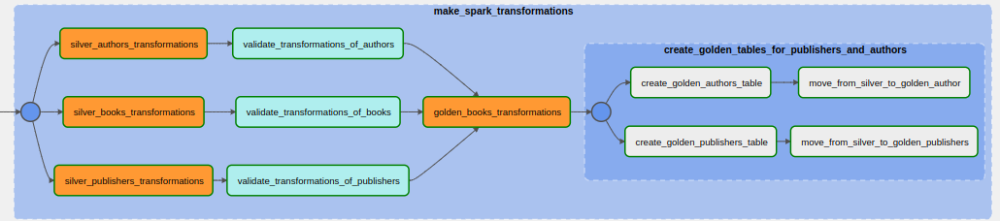

# Description
This repository houses a project that is designed for conducting an analysis of books, their authors, and publishers on the renowned [web-site LiveLib](https://www.livelib.ru/). The project's pipeline regularly extracts information from the "New Books" page and populates relevant tables with details about the books, their authors, and publishers. These tables undergo specific transformations that are essential for subsequent tasks such as creating dashboards and developing recommender systems.

# Technologies used
The books warehouse is made from the following tools: 

* Parsing: BeautifulSoup4
* Transformations: Apache Spark, Scala
* Data validation: Great Expectations
* Database: PostgreSQL
* Orchestration: Apache Airflow
* Contrainers: Docker, docker compose
* Dashboards: Apache Superset

To implement containers, a modified version of the original Airflow docker compose file is employed, which includes two [bitnami Spark services](https://hub.docker.com/r/bitnami/spark/).

All the necessary modules used in the pipeline are listed in the [requirements.txt](requirements.txt) file.

# Architecture

The book warehouse system is designed to operate seamlessly via Docker containers, utilizing docker compose to facilitate container orchestration. This allows for the system to be easily scaled, deployed, and managed, making it highly efficient and effective.


Each day, the system extracts data from the "New Books" page, using the powerful parsing capabilities of BeautifulSoup4. After acquiring the links to the books, the system employs four parallel threads to simultaneously parse data from each book page, greatly reducing the time taken to complete this task.


The author and publisher IDs are then extracted and passed on to different tasks using XComs. The system uses separate parsers for each of these sections, ensuring that the data extraction process is highly efficient and accurate.


Once the data is obtained, it undergoes a rigorous cleaning and transformation process using the powerful Apache Spark and Scala tools. This process is essential for preparing the data for downstream tasks such as creating dashboards and developing recommender systems.

The system stores the data in various schemas, utilizing the medallion architecture to store intermediate and final results. 



Before the data is pushed to the golden schema, it is validated using Great Expectations. This ensures that the data is of the highest quality, with null values and outliers effectively identified and removed. This data validation step ensures that the downstream analytical tasks can be performed accurately and efficiently.


# Installation
1. Download and install:
    * Docker, docker compose
    * Scala, sbt
2. Clone repo locally.
3. Create image for Apache Airflow:
```
docker build -f Dockerfile.Airflow . -t airflow-spark 
```
4. Create image for Apache Spark:
```
docker build -f Dockerfile.Spark . -t spark-air  
```
5. Compile all scala files with Apache Spark code, move it to directory where Airflow looks for them and additionally download PostgreSQL driver:
```
sh setup.sh
```
# Usage
When installation is complete, you can run `docker compose` to start all necessary services.

Check whick ip does your postgres have by using command:
```
docker inspect -f '{{range.NetworkSettings.Networks}}{{.IPAddress}}{{end}}' bookswarehouse-postgres-1
```
Add it as connection on Airflow GUI.
Since docker assigns different ip's to its containers, your might be different from mine, and you might need to change respective values in .scala files and Great Expectations .yml config. Second connection you need to create is Apache Spark, where provide path to Spark Master (`spark://spark:7077`)
# Data validation

For ensuring that transformations are successful and data doesn't contains anomalies is performed validation with Great Expectations. Following checks are performed:

1. Null values not acceptiptible in most columns.
2. Values "Year", "Rating", "Pages" etc. should be in acceptible range.
3. Values "Favorite" "Liked", "Disliked", "Neutral", "HaveRead", "Planning" etc. should be greater or equal to 0.


# Limitations and Future work

The book warehouse project, in its current state, serves as a proof-of-concept for data extraction and analysis from LiveLib. However, there are several limitations that can be addressed in future work to further improve its capabilities.

Firstly, one improvement that can be made is to check whether any type of page has already been parsed and stored in the database. This would prevent the system from unnecessarily parsing the same page multiple times, saving valuable computational resources and time.

Alternatively, the implementation of a Slowly Changing Dimension (SCD) type 2 would allow for the tracking of changes in page activity over time, which would provide valuable insights into the trends and patterns in the data.

Another avenue for future work would be to add different parsers to make the database more complex and populated. For example, LiveLib has additional pages such as "Reviews", "Quotes", and "Selections" that could be used to create tables or dimensions for Books. This would provide a more comprehensive view of the data and enhance the system's ability to perform downstream tasks, such as creating dashboards and developing recommender systems.

Overall, while the book warehouse project represents an excellent starting point, there are several areas for future work that can be explored to enhance its capabilities and ensure that it remains a valuable tool for data extraction and analysis from LiveLib.